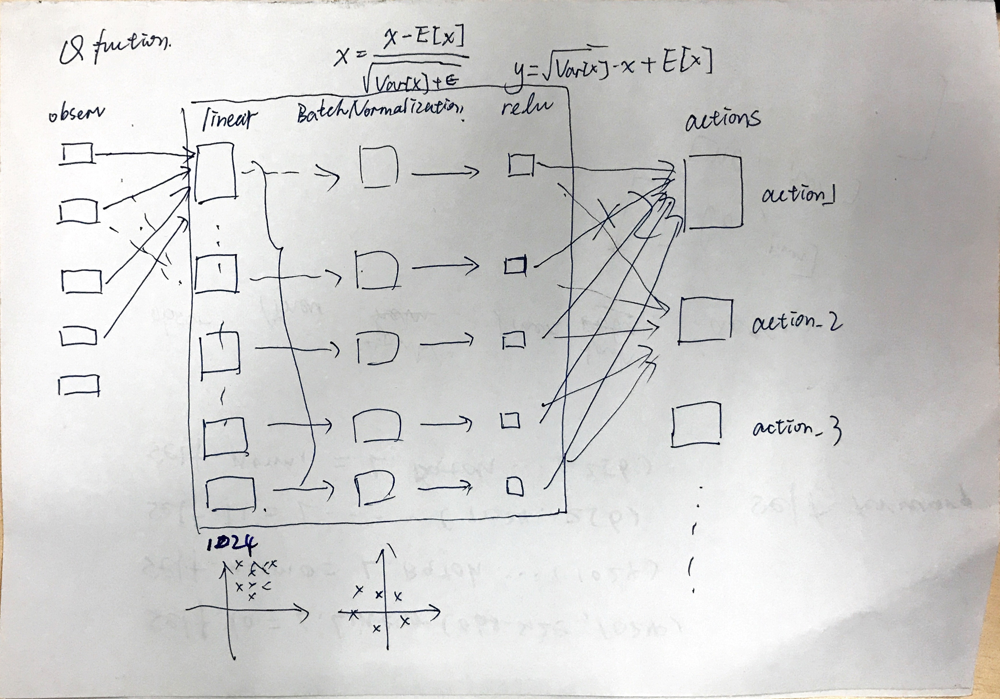

# Malware Env for OpenAI Gym

The goal of this project is to improve the author's [original work](https://github.com/endgameinc/gym-malware).  
In his Paper: **Evading Machine Learning Malware Detection**, He builds a framework for attacking static PE anti-malware engines based on reinforcement learning.

Sth. like this:

## Basics
There are two basic concepts in reinforcement learning: 
* the environment (in our case, the malware sample) 
* the agent (namely, the algorithm used to change the environment).  

The agent sends `actions` to the environment, and the 
environment replies with `observations` and `rewards` (that is, a score).

This repo provides an environment for manipulating PE files 
and providing rewards that are based around bypassing AV.  
An agent can be deployed that have already been written for the rich ``gym`` framework.  For example

1. https://github.com/pfnet/chainerrl [recommended]
2. https://github.com/matthiasplappert/keras-rl

`CartPole-v0` example in chainerrl DQN describes Q-function:
 
## Gym-Malware Environment
EvadeRL pits a reinforcement agent against the malware environment consisting of the following components:

* Action Space
* Independent Malware Classifier
* OpenAI framework malware environment (aka gym-malware)
 
## Action Space

The moves or actions that can be performed on a malware sample in our environment consist of the following binary manipulations:
* append_zero
* append_random_ascii
* append_random_bytes
* remove_signature
* upx_pack
* upx_unpack
* change_section_names_from_list
* change_section_names_to random
* modify_export
* remove_debug
* break_optional_header_checksum

in his paper action space describes like this:
* add a function to the import address table that is never used
* manipulate existing section names
* create a new(unused) sections
* append bytes to extra space at the end of sections
* create a new entry point which immediately jumps to the original entry point
* manipulate (break) signature
* manipulate debug info
* pack or unpack the file
* modify (break) header checksum
* append bytes to the overlay (end of PE file)

The agent will randomly select these actions in an attempt to bypass the classifier (info on default classifier below). Over time, the agent learns which combinations lead to the highest rewards, or learns a policy (*like an optimal plan of attack for any given observation*).

## Independent Classifier

Included as a default model is a [gradient boosted decision trees model] trained on 50k malicious and 50k benign samples with the following features extracted:
* Byte-level data (e.g. histogram and entropy)
* Header
* Section
* Import/Exports

[gradient boosted decision trees model]: http://scikit-learn.org/stable/modules/generated/sklearn.ensemble.GradientBoostingClassifier.html